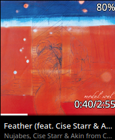
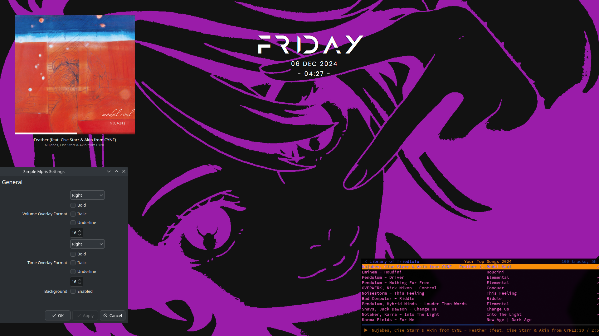

<div align="center">
  
  <h1>Simple MPRIS</h1>
</div>

A minimalist MPRIS media player widget for KDE Plasma 6.0+. Because ricing is serious business and the default Plasma MediaController isn't what we'd deem 【Ａｅｓｔｈｅｔｉｃ】。 

So I chopped out the fat and went for a... (人◕‿◕) 𝕞𝕚𝕟𝕚𝕞𝕒𝕝𝕚𝕤𝕥𝕚𝕔 look, should scale decently on any screen size but if you have an issue with it let me know.

### Install

1. Download or clone this repository
2. Either throw it into ~/.local/share/plasma/plasmoids or you can use:
   ```shell
   kpackagetool6 -i simple-mpris.plasmoid

### Features

- basic playback control keybinds
- visual feedback during seek/volume change
- Adjustable widget opacity (scroll to fade)
- Optional (Kirigami default) background
- ...I said it was minimalistic
<div align="center">

</div>

<div align="center">
<details>

<summary style="font-size: 1.2em;">Desktop Screenshot</summary>


</details>
</div>

### Keybinds

  `Space`: Toggle pause/play

  `Left/Right`: Seek backward/forward by 5 seconds

  `Ctrl + Left/Right`: Previous/next track

  `Up/Down`: Adjust volume

  `Mouse wheel`: Adjust widget opacity


